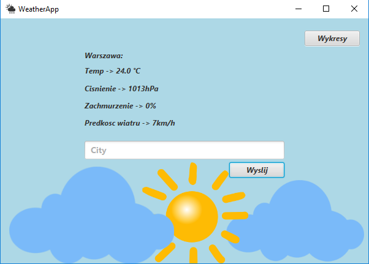
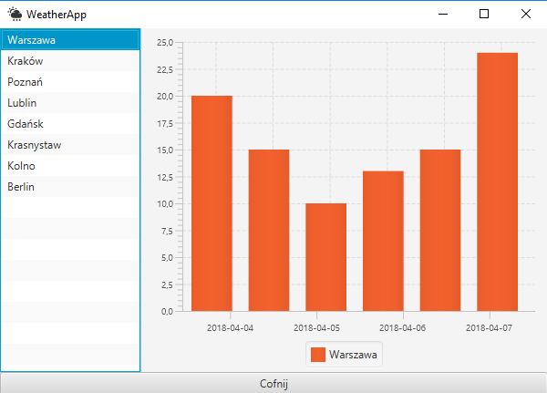

# WeatherService
 WeatherService is a simple JavaFX application.

## Table of contents
* [General info](#general-info)
* [Screenshots](#screenshots)
* [Technologies](#technologies)
* [Status](#status)
* [Contact](#contact)

## General info
I created this application to learn how to use external APIs and also expand my knowledge on MySQL and JavaFX.

## Screenshots

City search section and weather checking:

The weather history section:

## Technologies
* Java 8
* JavaFX 
* MySQL

## Status
Project is: _finished_

## Contact
Created by [@Paweł_Łukaszewski](https://www.linkedin.com/in/paweł-łukaszewski) - feel free to contact me!
